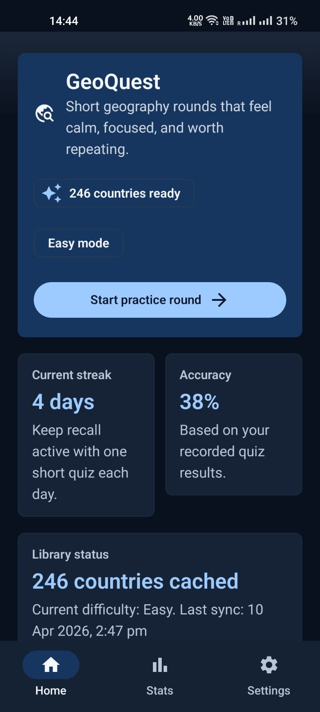
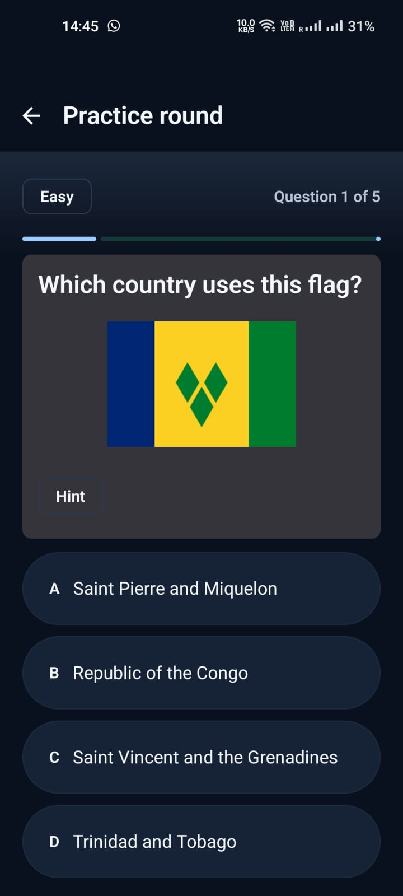
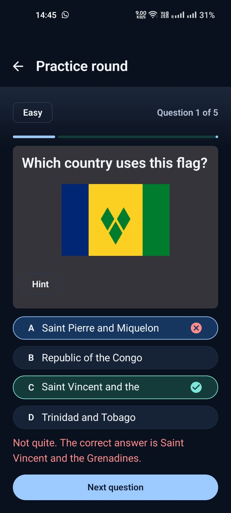
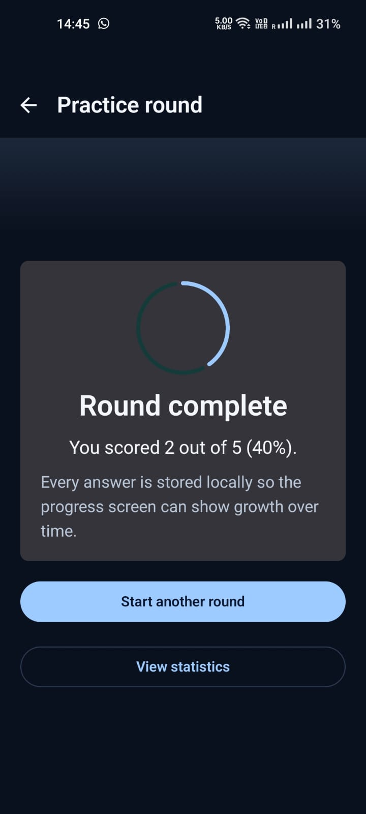
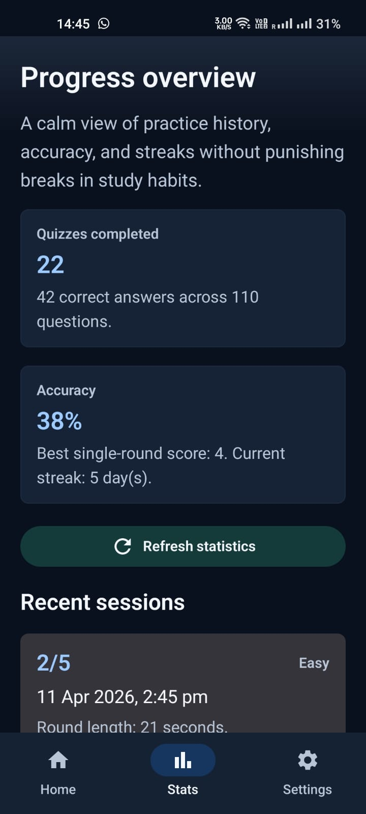
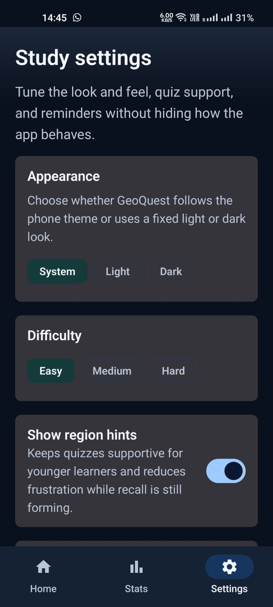
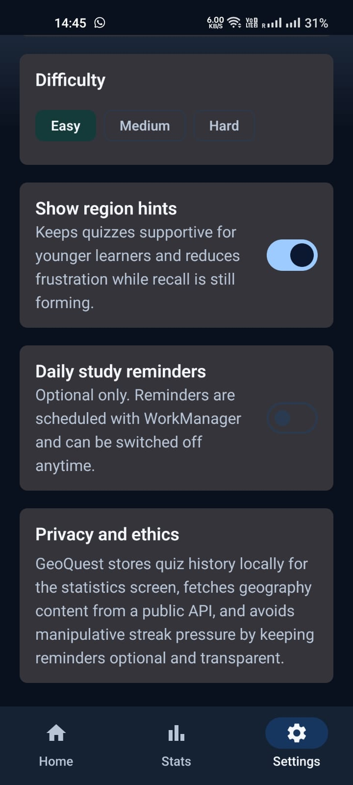
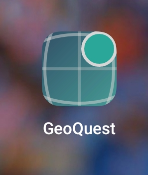

# GeoQuest

GeoQuest is an Android educational app built in Kotlin with Jetpack Compose for Assignment 3. The app helps secondary-school learners improve geography knowledge through short quiz rounds focused on country flags, capitals, revision habits, and progress tracking.

## Overview

The project was designed around the assessment requirements and the lecture topics covered in class:

- Android Studio + Kotlin
- Jetpack Compose + Material Design 3
- multi-screen navigation
- internet connectivity
- local persistence
- modern Android architecture
- testing
- ethical and accessible mobile design

## Core Features

- Home screen with learning summary, sync status, and quick actions
- Practice round screen with flag and capital questions
- Settings screen with difficulty, hints, reminders, and appearance mode
- Statistics screen with accuracy, streaks, and recent sessions
- Custom adaptive app icon and polished app-wide theme
- Optional hint reveal during quiz rounds
- Optional daily reminder notifications

## Screenshots

<table>
  <tr>
    <td align="center">
       
      <strong>Home</strong>
    </td>
    <td align="center">
       
      <strong>Quiz Question</strong>
    </td>
    <td align="center">
       
      <strong>Answer Feedback</strong>
    </td>
  </tr>
  <tr>
    <td align="center">
       
      <strong>Round Complete</strong>
    </td>
    <td align="center">
       
      <strong>Statistics</strong>
    </td>
    <td align="center">
       
      <strong>Settings</strong>
    </td>
  </tr>
  <tr>
    <td align="center">
       
      <strong>Reminders and Ethics</strong>
    </td>
    <td align="center">
       
      <strong>App Icon</strong>
    </td>
    <td></td>
  </tr>
</table>

## Technical Stack

- Kotlin
- Jetpack Compose
- Material 3
- Navigation Compose
- Room
- DataStore Preferences
- Retrofit + OkHttp
- Koin dependency injection
- WorkManager

## Architecture

The app follows an MVVM-style structure:

- `ui/` for Compose screens, navigation, and theming
- `data/` for Room, Retrofit, DataStore, and repository code
- `domain/` for quiz logic and statistics calculation
- `worker/` for background refresh and reminder scheduling

Main architectural decisions:

- `ViewModel` manages screen state
- `GeoQuestRepository` coordinates API, Room, and domain logic
- `UserPreferencesRepository` stores learner preferences in DataStore
- Room stores country cache and quiz attempt history

## Assessment Requirement Mapping

- Four core screens: implemented
- Navigation between screens: implemented
- Internet/API usage: implemented via REST Countries API
- Local database: implemented with Room
- User settings persistence: implemented with DataStore
- Background work: implemented with WorkManager
- Runtime permission handling: implemented for notifications
- Unit tests: implemented for quiz engine and statistics logic
- UI testing: Compose test source included

## Ethical and UX Decisions

GeoQuest was designed as a realistic but responsible study app:

- quiz history is stored locally rather than in the cloud
- reminders are opt-in, not forced
- notifications require permission before being enabled
- hints support learning without dark-pattern pressure
- progress language is supportive rather than guilt-driven
- the app avoids manipulative streak mechanics

## Running the App

1. Open the project in Android Studio.
2. Allow Gradle sync to finish.
3. Run the `app` configuration on an emulator or Android device.
4. If reminders are enabled on Android 13 or later, grant notification permission when prompted.

## Testing

Verified tasks:

- `assembleDebug`
- `testDebugUnitTest`
- `compileDebugAndroidTestKotlin`

## Submission Files

The repository includes the Android Studio project source code and this README.
